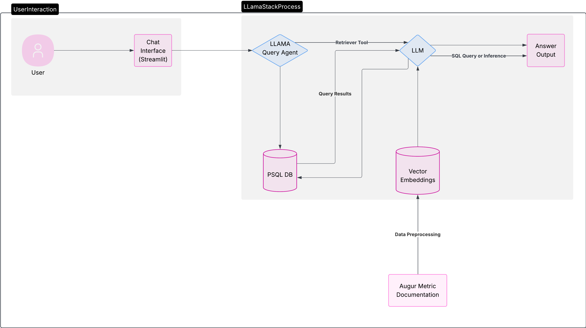

Sahana Sreeram - Software Engineering Intern

Working Repo:
[[https://github.com/redhat-et/augur-chatbot]{.underline}](https://github.com/redhat-et/augur-chatbot)

### Background & Motivation

Augur Assistant transforms how Red Hat and the CHAOSS community access
project health data by layering a natural-language agent over our
OSPO-managed Augur database of 40K+ repositories. The capabilities and
goals of the tool are as follows:

-   Accessible Insights: Enables non-technical users (community
    managers, contributors) to run complex queries without SQL

-   Boosts visibility: Scans real-time metrics on Red Hat's open-source
    footprint and contributor affiliations, activity trends, license
    breakdowns

-   Proves small-model inference: Validated a lightweight MCP-powered
    pipeline (Llama Instruct 3B) for domain-specific agents, opening the
    door to low-latency, tool-exec AI workflows across the organization.

### Tech Stack
|  Layer                 |  Component                          |  Role & Description                                                                                                                                                              |
|------------------------|-------------------------------------|----------------------------------------------------------------------------------------------------------------------------------------------------------------------------------|
|  Model Serving         |  Ollama                             |   Self-hosted Llama models (3B or 7B Instruct) served via Ollama                                                                                                              |
|  Agent Orchestration   |  LlamaStack Agent                   |    Interprets “use execute_sql()” instructions   Emits structured execute_sql(sql="…") calls                                                                            |
|  Schema Retrieval      |  FAISS DB (stored in data folder)   |    Takes in prewritten schema via augur_schema.json    Uses embedding model and saves to data   Indexes them for fast top-k lookup of relevant schema snippets    |
|  Tooling protocol      |  MCP Server                         |    Registers custom-written mcp_execute server   Routes LLM-generated SQL to the database connector                                                                     |
|  Data Source           |  Postgres Augur DB                  |    Read-only use of Augur DB   Connects via .env variables and database credentials                                                                                     |
|  Frontend              |  Streamlit UI                       |    Optional SQL toggle and debug trace   Regex-driven parsing to render JSON results as clean text                                                                      |

{width="10.191686351706037in" height="5.78417104111986in"}

### Future planning:

|  Challenge                                                                      |  Next Actions                                                                                                                                                                                                                                                                                                                                                                                                                                                                                                                     |
|---------------------------------------------------------------------------------|-----------------------------------------------------------------------------------------------------------------------------------------------------------------------------------------------------------------------------------------------------------------------------------------------------------------------------------------------------------------------------------------------------------------------------------------------------------------------------------------------------------------------------------|
|  Polish Final Output    Human-readable results only, get rid of SQL dump  |  Enhance ui.py with regex/JSON hooks to surface only human-readable text (with an optional toggle for raw output).                                                                                                                                                                                                                                                                                                                                                                                                                |
|  Simplify setup                                                                 |  Create a docker-compose that simplifies all the setup commands                                                                                                                                                                                                                                                                                                                                                                                                                                                                   |
|  Fix Intent Parsing step by reducing model hallucination                        |  Challenge: Small-model errors and edge-case phrasing.   Next:      Embed few-shot Q→SQL examples in the prompt.    Test larger models or non-Llama models. 7B versions seem to work much better than 3B   Better prompt tuning                                                                                                                                                                                                                                                                        |
|  Modular Agent-to-Agent Pipeline                                                |  Challenge: A monolithic agent struggles to juggle schema retrieval, SQL generation, execution and output formatting all at once.       			    Next:    Split responsibilities into specialized agents:      Schema Agent – selects top K tables/columns    SQL Agent – builds valid queries    Execution Agent – runs the SQL via MCP    Output Agent – parses and converts to NL        			    Orchestrate them in a lightweight workflow (feedback per Josh Berkus).  |
|  Build an Augur Playground for Red Hatters to access without setup              |  Challenge: Requires individual Augur instances/credentials.   Next:      Offer a managed “playground” Augur DB pre-loaded with RH data.    Provide a one-click Docker/SQLite snapshot for local demos.    Implement role-based access for unredacted metrics.                                                                                                                                                                                                                                         |
|  Broaden integration                                                            |  A last step could be to turn Augur Assistant into a Red Hat-specific Discord bot, or integrate with Ask Red Hat                                                                                                                                                                                                                                                                                                                                                                                                                  |

### Project ownership

-   Handoff to OSPO (post-Summer 2025)

    -   Formal transfer of code, documentation, and support for future
        planning responsibilities

-   Upstream community

    -   Opportunity to partner with the upstream CHAOSS community in the
        Data Science Working Group

    -   Some members of the community have expressed interest in
        AI/ML/agentic workflows. This project could be an area for them
        to work on. \*\* Especially integration with A2A

-   Long-term support:

    -   OSPO to maintain the production-hosted Augur Assistant instance.

    -   CHAOSS to own the open-source roadmap, issue triage, and model
        updates.
